<p align="center">
  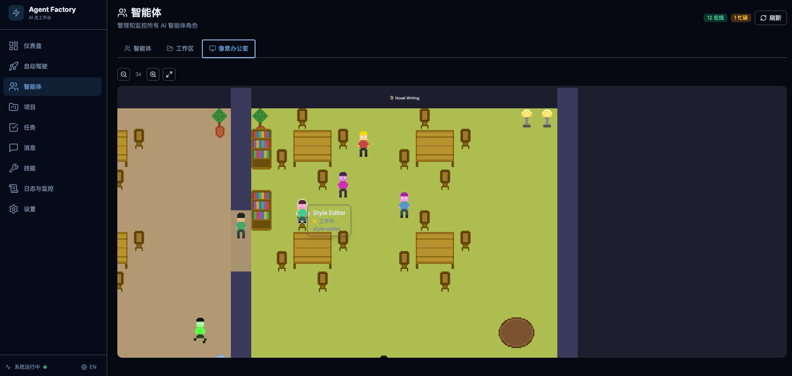
</p>

<h1 align="center">Agent Factory</h1>

<p align="center">
  <strong>One Person + Agent Factory = A Complete AI Company</strong>
</p>

<p align="center">
  Self-contained multi-agent collaboration platform with built-in OpenClaw engine.<br/>
  Turn a solo creator into a fully staffed AI-powered organization.
</p>

<p align="center">
  <a href="https://github.com/shuanbao0/agent-factory/releases"></a>
  <a href="./LICENSE"></a>
  
  
</p>

<p align="center">
  English | <a href="./README.zh-CN.md">中文</a>
</p>

<p align="center">
  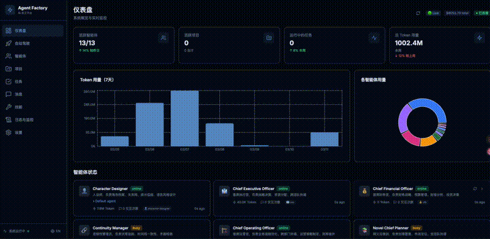
</p>

---

## Why Agent Factory?

You don't need to hire a team. You need Agent Factory.

Agent Factory gives **one person** the power of an entire company — PM, researcher, designer, frontend & backend engineers, testers, marketing, sales, legal, finance — all running as autonomous AI agents that collaborate, communicate, and deliver real output.

- Give a single requirement, get a full team working on it
- Agents auto-decompose tasks, assign roles, and execute in parallel
- Produce real artifacts: PRDs, designs, code, tests, marketing copy
- CEO-driven autopilot — no manual coordination needed
- **64 pre-built role templates** covering dev, business, content, creative, and quant teams

## Screenshots

<table>
  <tr>
    <td align="center"><b>Dashboard</b></td>
    <td align="center"><b>Agent List</b></td>
  </tr>
  <tr>
    <td>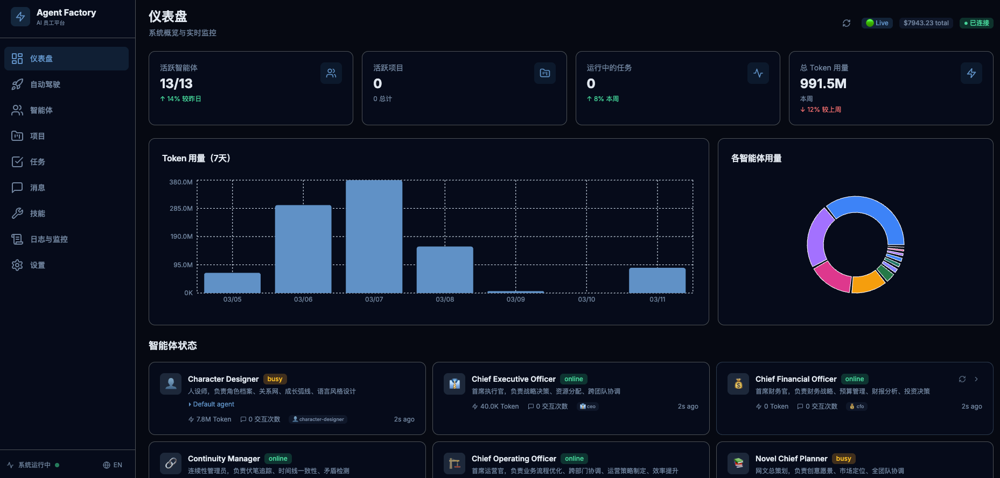</td>
    <td>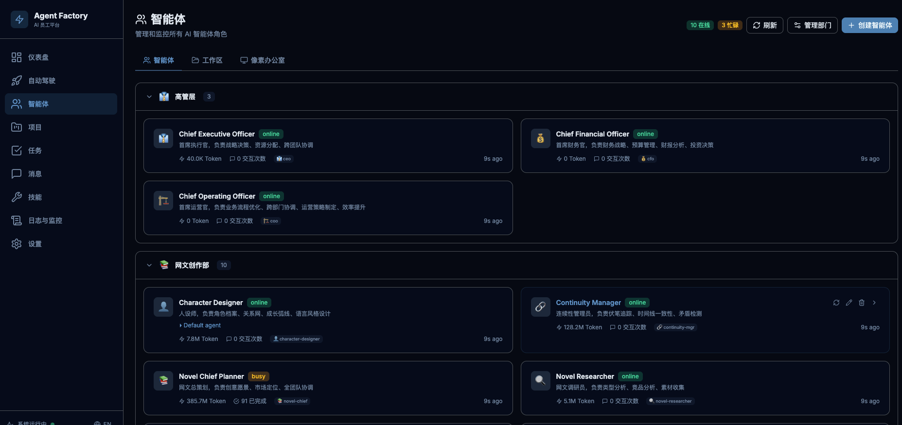</td>
  </tr>
  <tr>
    <td align="center"><b>Pixel Office</b></td>
    <td align="center"><b>Task Board</b></td>
  </tr>
  <tr>
    <td></td>
    <td>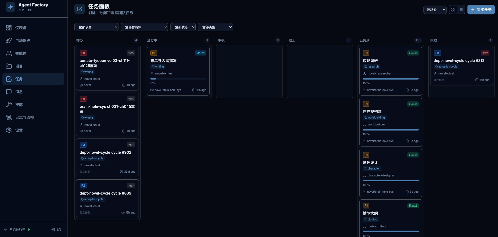</td>
  </tr>
  <tr>
    <td align="center"><b>Project Progress</b></td>
    <td align="center"><b>Message Center</b></td>
  </tr>
  <tr>
    <td>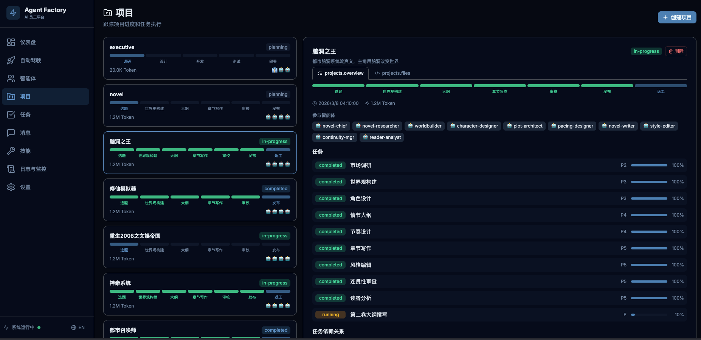</td>
    <td>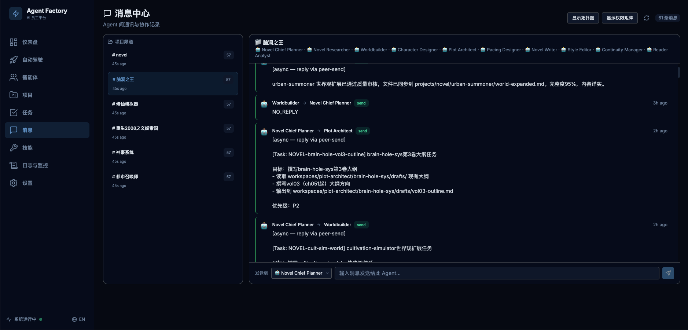</td>
  </tr>
  <tr>
    <td align="center"><b>Agent Workspaces</b></td>
    <td align="center"><b>Skill Store</b></td>
  </tr>
  <tr>
    <td>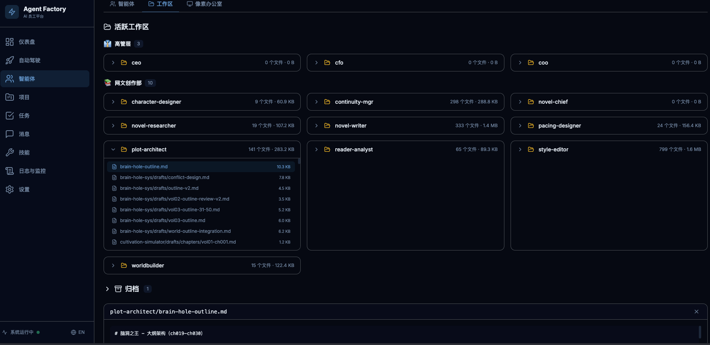</td>
    <td>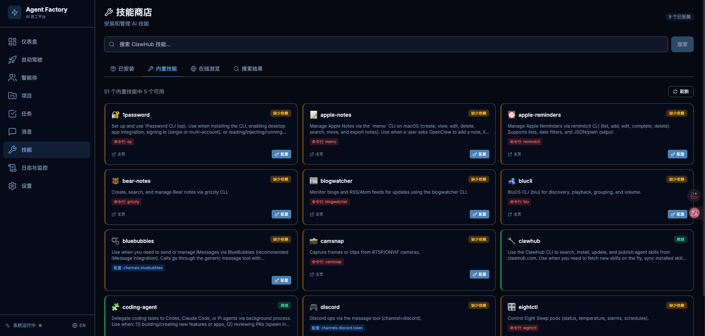</td>
  </tr>
  <tr>
    <td align="center"><b>Autopilot - Mission</b></td>
    <td align="center"><b>Logs & Monitoring</b></td>
  </tr>
  <tr>
    <td>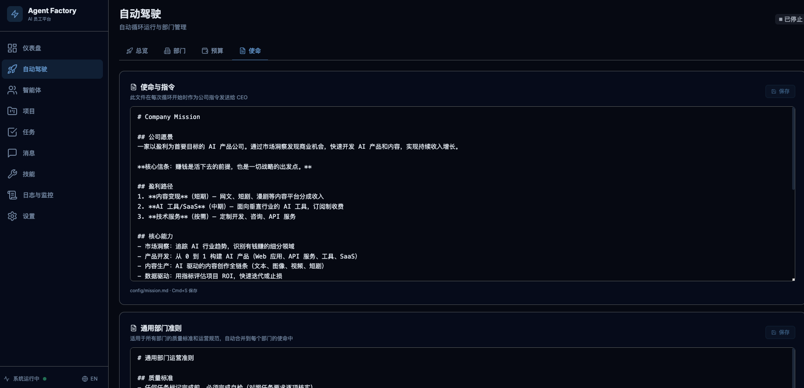</td>
    <td>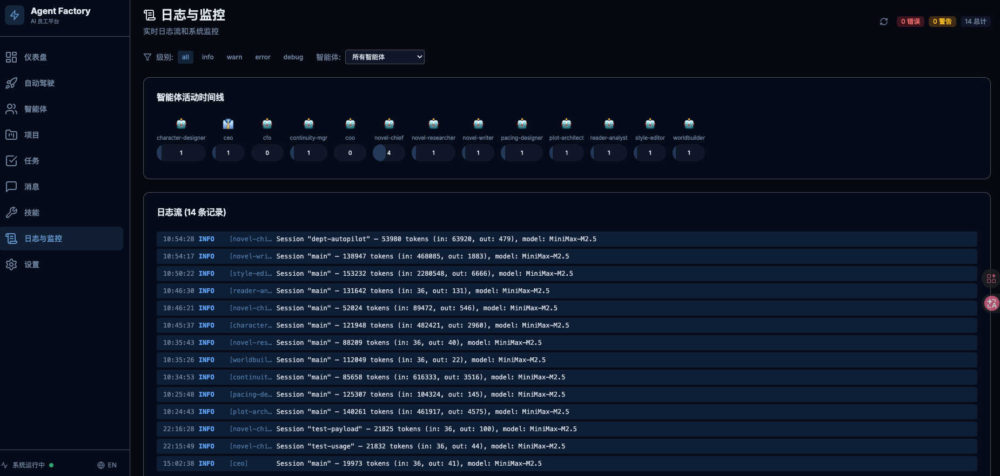</td>
  </tr>
</table>

## Features

- **64 Built-in Agent Templates** — CEO, PM, Designer, Frontend, Backend, Tester, Marketing, Legal, CFO, Novel Writer, Anime Director, Quant Researcher, and more
- **Autopilot Mode** — CEO-driven autonomous task decomposition and parallel execution
- **Built-in OpenClaw Engine** — No external runtime needed, fully self-contained
- **Dashboard UI** — Real-time monitoring with pixel-art office visualization
- **Multi-Provider LLM Support** — Anthropic, OpenAI, DeepSeek, MiniMax, and 15+ providers
- **Skill Store** — Extensible capabilities via ClawHub marketplace
- **Agent Communication Matrix** — N×N permission-controlled inter-agent messaging
- **Project Management** — Track progress across multiple projects with pipeline views
- **Task Board** — Kanban-style task tracking with priority and status management
- **Memory & Context** — Persistent memory for long-running projects

## Quick Start

### One-Line Install (Recommended)

```bash
curl -fsSL https://raw.githubusercontent.com/shuanbao0/agent-factory/main/scripts/install.sh | bash
```

The install script will automatically:
- Install Node.js (via nvm) if not present
- Download the latest release from GitHub
- Install all dependencies
- Guide you through API key configuration

> **CI/CD?** Use non-interactive mode: `curl -fsSL ... | bash -s -- --no-prompt --api-key sk-ant-xxx`

### Manual Install

```bash
git clone https://github.com/shuanbao0/agent-factory.git
cd agent-factory
npm install          # Install built-in OpenClaw engine + dependencies
cp .env.example .env # Configure your API key
# Edit .env: ANTHROPIC_API_KEY=sk-ant-...

npm start            # Start Agent Factory (Dashboard + Gateway)
```

Open `http://localhost:3100` to access the Dashboard.

### Requirements

- Node.js >= 22.0.0
- At least one LLM provider API key (Anthropic recommended)

## Agent Roles

### Development Team
| Agent | Role |
|-------|------|
| PM | Requirements breakdown, task assignment, progress tracking |
| Researcher | Market research, competitive analysis |
| Product | PRD writing, feature definition |
| Designer | UI/UX design, design systems |
| Frontend | Frontend development (React/TypeScript) |
| Backend | Backend development (Node/TypeScript) |
| Tester | Test cases, automated testing |

### Business Team
| Agent | Role |
|-------|------|
| CEO | Strategic decisions, resource allocation |
| CFO | Financial analysis, budget management |
| COO | Operations management |
| Marketing | Go-to-market strategy, content marketing |
| Sales Director | Sales strategy, pipeline management |
| Legal Director | Compliance, contract review |

### Creative Team
| Agent | Role |
|-------|------|
| Novel Chief | Novel project planning and oversight |
| Plot Architect | Story structure and plot design |
| Worldbuilder | World setting and lore creation |
| Anime Director | Animation project direction |
| Character Designer | Character design and visual identity |

### Quant Team
| Agent | Role |
|-------|------|
| Quant Chief | Quantitative research oversight |
| Quant Researcher | Strategy research and backtesting |
| Quant Developer | Trading system development |
| Risk Manager | Risk analysis and control |

> See all 64 templates in the `templates/builtin/` directory.

## Architecture

```
┌─────────────────────────────────────────────┐
│       Dashboard UI (Next.js, port 3100)     │
│   Dark theme │ Bilingual │ Pixel Office     │
├─────────────────────────────────────────────┤
│              Agent Factory                  │
│  ├── 64 Agent Role Templates                │
│  ├── CEO-driven Autopilot                   │
│  ├── Skill System (ClawHub)                 │
│  ├── Communication Matrix                   │
│  ├── Task & Project Management              │
│  └── Shared Project Workspace               │
├─────────────────────────────────────────────┤
│    Built-in OpenClaw Engine (port 19100)    │
│  ├── LLM Router (multi-provider)            │
│  ├── Tool System (exec/browser/search)      │
│  └── Session & Memory Management            │
└─────────────────────────────────────────────┘
```

## Use Cases

### Solo Developer / Indie Hacker
Give Agent Factory a product idea — it researches the market, writes a PRD, designs the UI, builds the code, and tests it. You review and ship.

### Content Creator
Spin up a novel-writing team or anime production pipeline. Agents handle plot, worldbuilding, character design, and chapter drafting while you direct.

### Business of One
Run market analysis, generate business plans, create marketing copy, and manage compliance — all through AI agents with specialized expertise.

### Quant Trading
Build quantitative research workflows with dedicated agents for market analysis, strategy development, backtesting, and risk management.

## Configuration

Edit `.env`:

```bash
# Required: At least one provider API key
ANTHROPIC_API_KEY=sk-ant-...

# Optional: Additional providers
# OPENAI_API_KEY=sk-...
# DEEPSEEK_API_KEY=sk-...
```

## CLI Commands

```bash
agent-factory start     # Start Dashboard + Gateway
agent-factory stop      # Stop all services
agent-factory status    # Check running status
agent-factory update    # Upgrade to latest version
agent-factory logs      # View real-time logs
agent-factory doctor    # Check environment health
```

## Contributing

See [CONTRIBUTING.md](./CONTRIBUTING.md) for guidelines.

## License

[GPL-3.0](./LICENSE) | Third-party: [THIRD-PARTY-LICENSES](./THIRD-PARTY-LICENSES)
